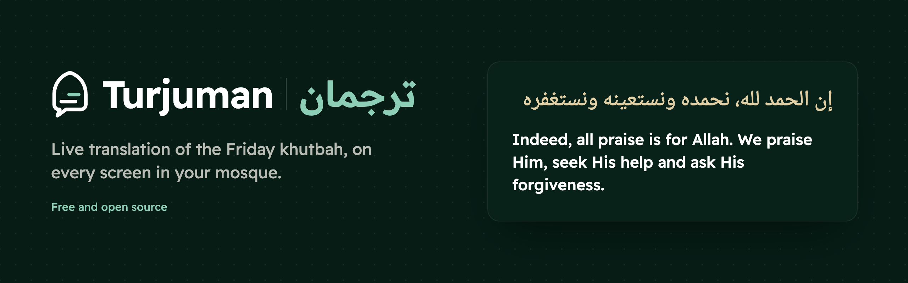

<p align="center">
  
</p>

# Turjuman

Live translation of the khutbah on the mosque's screens. The imam speaks Arabic; the
congregation reads the translation in their own language, seconds after each sentence. It works
the same for lessons and talks.

Free for the ummah, and open source under the MIT licence.

- **One link per screen.** It runs in OBS Studio as a Browser Source, or in any browser.
- **Prayer moments:** the Athan, Iqama and Salah are recognised, and the captions make way for them.
- **Quran verses** are shown with a verified reference.
- **Your own look:** every colour, font, size and layout of the captions can be changed.
- **From your phone:** switch screens on and off, and start the prayer cards by hand.
- **Your own key:** speech recognition and translation run on your own Soniox account.

Use it at **[turjuman.nl](https://turjuman.nl)**: sign up, add your Soniox key, and make your
first screen.

## Run it yourself

The self-hosted edition, for one mosque, is
**[turjuman-translator/cli](https://github.com/turjuman-translator/cli)**: the same app with the
`turjuman` command, and a step-by-step guide from install to captions on the screen.

```bash
git clone https://github.com/turjuman-translator/cli.git turjuman
cd turjuman
make up            # Docker; without Docker: pnpm install && pnpm build && pnpm turjuman start
```

The first start makes the config and downloads the Quran data by itself. Then open the app
(`make admin`), create your admin account and add your Soniox key under **Keys**.

## Host it for many mosques

One server can serve many mosques:
- the website is at `/`;
- mosques sign up themselves, add their own Soniox key, and manage their own screens;
- they never see each other's.

```bash
git clone https://github.com/turjuman-translator/website.git turjuman
cd turjuman
make up
```

`make up` creates everything: the config (hosted mode, behind a proxy), the admin token and the
Quran data. Put your HTTPS proxy in front of `127.0.0.1:8765`: the
[nginx block](docs/hosting.md#nginx). The hostname is nginx's alone; every link follows it.
More: [docs/hosting.md](docs/hosting.md).

## Develop

This repository is the whole of Turjuman. The self-hosted edition is generated from it
(`scripts/export-selfhost.ts`).

| Folder | What |
|---|---|
| `src/` | The server: sessions, speech recognition (Soniox), accounts, organisations, the `turjuman` command |
| `web/` | The app (dashboard, screen builder, look editor, keys) and the caption page |
| `site/` | The website shown at `/` in hosted mode, in English, Dutch and Arabic |
| `docs/` | The [guide](docs/guide.md), the [CLI](docs/cli.md), [Docker](docs/docker.md), [caption looks](docs/presets.md) and [hosting](docs/hosting.md) |
| `selfhost/` | The README of the self-hosted edition |

```bash
pnpm install
pnpm build          # server, app and website
pnpm test           # unit tests (offline, no API calls)
pnpm typecheck && pnpm lint
```

How to contribute: [CONTRIBUTING.md](CONTRIBUTING.md).

## Your keys and your data

- **Self-hosted:** your Soniox key stays on your own computer, in `.env`, or encrypted in
  `orgs.yaml` when you add it in the app.
- **Hosted:** each mosque's Soniox key is encrypted with AES-256-GCM, and the app never shows it
  again.
- **Logs:** keys are removed from every log line.
- **Audio:** goes from the computer that shows the captions to the server, and from there to
  Soniox. No audio is stored.
- **Caption history:** kept on the server, and can be switched off.

Details: [SECURITY.md](SECURITY.md).

## Licence

MIT, see [LICENSE](LICENSE). The Quran text (Tanzil) and the Quran translations come with their own
terms, listed in [NOTICE](NOTICE).
